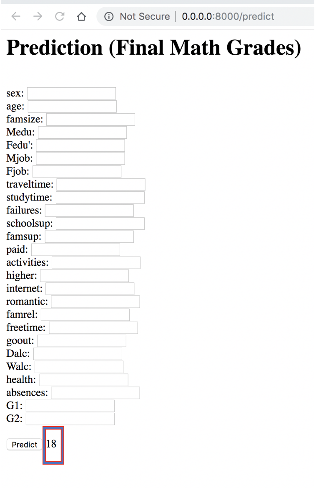

# To run locally:

1- Install pip and Python 3 (recommend 3.6)

2- Clone this repository 

3- Navigate to the working directory cd DevFest19/model-deployment-flask

4- Install the Python dependencies pip install -r requirements.txt

5- Run the API python app.py

6- Open a web browser and go to http://0.0.0.0:8000

